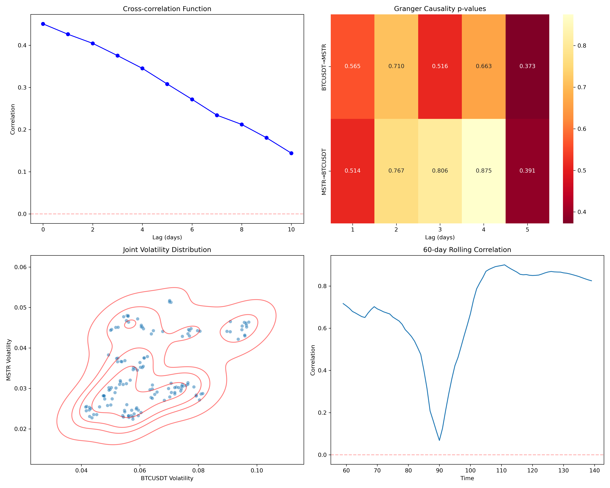
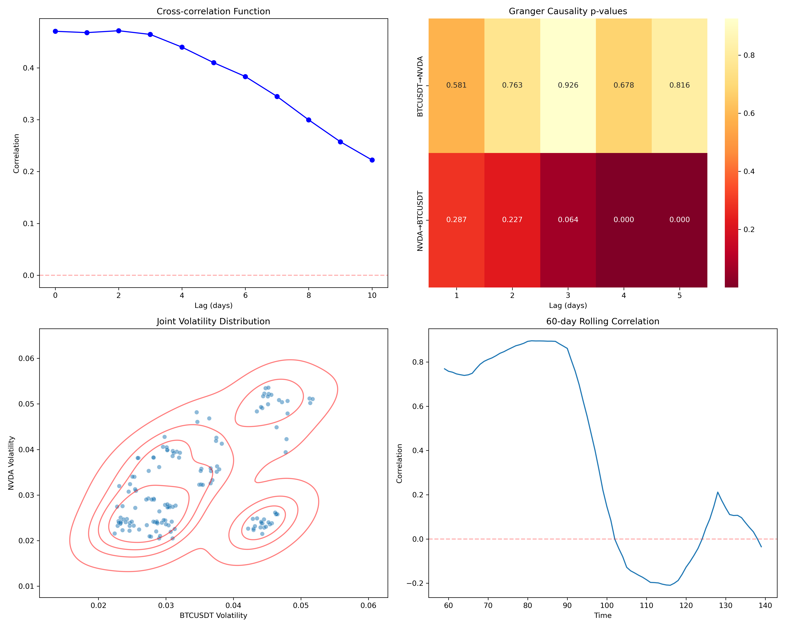

# Purpose of project

Exploring the cross-section of crypto and stocks. More specifically, the relationship between the volatilities.
Any two assets that can be fetched from FMP or Binance can be compared. This means, the code, with some tweaking, can compare stocks with stocks, stocks with crypto and crypto with crypto.
The current setup favors comparison between stock and crypto.

## Volatility Analysis

I built this, as I wanted to explore whether $MSTR has essentially become a proxy for BTC due to their large holding of bitcoin.
Below I will show two cases, using market data between June 1, 2024 and January 24, 2025.

### MSTR and BTC

Analysis of variance correlation between MicroStrategy (MSTR) and Bitcoin (BTC) shows:

- Strong persistent correlation between volatilities (0.45 at lag 0) with smooth decay over time
- Temporary decorrelation at period 90 followed by strengthened relationship
- Balanced bidirectional Granger causality with neither asset consistently leading
- Tight volatility clustering along diagonal indicating synchronized market movements

The analysis confirms MSTR's strong fundamental linkage to Bitcoin's market behavior, consistent with its business model as a Bitcoin holder.

### NVDA and BTC

Analysis of variance correlation between NVIDIA (NVDA) and Bitcoin (BTC) reveals:

- Initial high correlation between volatilities that breaks down significantly after period 90, suggesting temporary rather than fundamental relationship
- Asymmetric Granger causality with Bitcoin movements leading NVIDIA volatility changes (p-values < 0.01)
- Dispersed volatility clusters showing limited synchronization between assets
- Correlation decay indicates relationship likely driven by broader market dynamics rather than direct causation

This pattern suggests NVIDIA's relationship with Bitcoin is circumstantial, influenced by market conditions rather than fundamental linkages.
